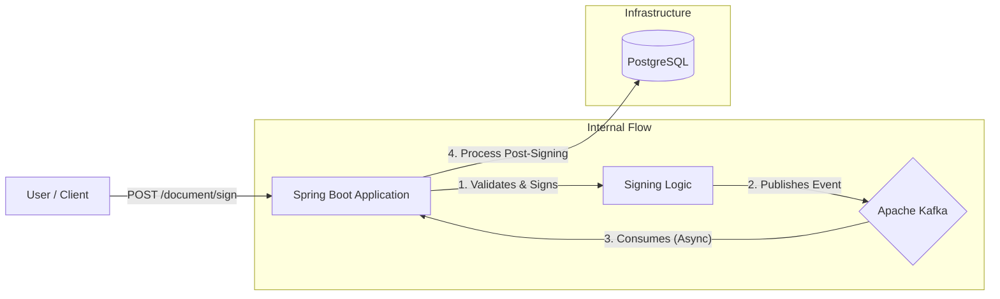

# Document Signing Simulator - Backend

## 📌 Project Overview
This project is a **Document Signing Simulator** backend service designed to demonstrate a robust, scalable, and modern software architecture. It simulates the process of digital document signing, managing users, certificates, and the signing workflow using asynchronous event-driven patterns.

This repository is built to showcase advanced Java development skills, including **Hexagonal Architecture (DDD)**, **Event-Driven Architecture (Kafka)**, and **Containerization (Docker)**.

---

## 🛠 Tech Stack

| Component | Technology | Version | Purpose |
|-----------|------------|---------|---------|
| **Language** | Java | **23** | Modern features, pattern matching |
| **Framework** | Spring Boot | **3.4.5** | Web, JPA, Profiling |
| **Database** | PostgreSQL | **17.5** | Relational persistence |
| **Messaging** | Apache Kafka | **7.2.6** | Async events, Decoupling, DLT |
| **Build Tool** | Maven | | Project management |
| **Containerization** | Docker | | Consistent environments, multi-stage builds |

---

## 🏗 Architecture

The project follows a **Hexagonal Architecture (Ports and Adapters)** to separate business logic from infrastructure concerns. This ensures testability and maintainability.

### 📂 Project Structure (`src/main/java/com/signingSimulator/signingSimulator`)

- **`domain`**: The heart of the application. Contains **Entities** (User, Certificate) and business exceptions. Pure Java, no framework dependencies.
- **`application`**: Contains **Use Cases** and **Ports** (interfaces). Definies *what* the application does.
    - `service`: Implementation of business logic (e.g., `DocumentService`, `UserService`).
    - `ports`: Interfaces for Input (Services) and Output (Repositories/Messaging).
- **`infrastructure`**: Implementation details and adapters.
    - `adapter/input/rest`: **REST Controllers** (API endpoints).
    - `adapter/input/event` : **Kafka Consumers**.
    - `adapter/output`: **JPA Repositories**, **Kafka Producers**.

### 📊 Diagrams

#### High-Level Design (HLD)
Overview of the system components and their interactions.



#### Low-Level Design (LLD) - Hexagonal Architecture
Detailed view of the **Signing Flow** using actual class names.

```mermaid
classDiagram
    direction LR

    %% Input Adapter
    class DocumentRestController {
        <<Rest Controller>>
        +signDocument(DocumentReqDTO)
    }

    %% Ports (Interfaces)
    class DocumentService {
        <<Input Port>>
        +signDocument()
    }

    class SigningService {
        <<Input Port>>
        +sign()
    }

    class MessagePublisher {
        <<Output Port>>
        +publishEvent()
    }

    %% Implementation (Application/Domain)
    class DocumentServiceImpl {
        <<Service>>
        +signDocument()
    }

    class SigningServiceImpl {
        <<Service>>
        -Validation
        -SigningStrategy
        +sign()
    }

    %% Output Adapter
    class PostSigningProcessorKafkaPublisherAdapter {
        <<Kafka Producer>>
        +publishEvent()
    }
    
    %% Input Adapter (Consumer)
    class PostSigningProcessorKafkaConsumerAdapter {
        <<Kafka Listener>>
        +consumeEvent()
    }

    %% Relationships
    DocumentRestController --> DocumentService : Calls
    DocumentServiceImpl ..|> DocumentService : Implements
    DocumentServiceImpl --> SigningService : Calls
    SigningServiceImpl ..|> SigningService : Implements
    SigningServiceImpl --> MessagePublisher : Uses
    PostSigningProcessorKafkaPublisherAdapter ..|> MessagePublisher : Implements
    
    %% Async Link
    PostSigningProcessorKafkaPublisherAdapter ..> PostSigningProcessorKafkaConsumerAdapter : "Async Event (Kafka)"
```



---

## 🚀 Key Features & Implementation Details

### 1. Event-Driven Signing Flow (Kafka)
The signing process is decoupled using Kafka to ensure reliability and scalability.
- **Topic**: `post-signing-topic`.
- **Consumer Group**: `signing-simulator-group-1`.
- **Reliability Pattern**:
    - **Retry Mechanism**: The consumer (`PostSigningProcessorKafkaConsumerAdapter`) is configured with `@RetryableTopic`.
    - **Backoff Strategy**: Exponential backoff (Delay: 1000ms, Multiplier: 2, Attempts: 4).
    - **Dead Letter Topic (DLT)**: Messages that fail after retries are sent to a DLT for manual inspection, preventing data loss.
    - **Simulated Errors**: Logic exists to simulate processing failures (e.g., for specific Certificate IDs) to demonstrate error handling.

### 2. Design Patterns
- **Chain of Responsibility**: Used in `PostSigningChainOfResponsability` to handle complex post-signing processing steps in a modular way.
- **Mapper Pattern**: `MapStruct` is used for efficient and type-safe conversion between DTOs and Domain Entities.
- **DTO Pattern**: Strict separation between API Data Transfer Objects (Req/Res) and Domain models.

### 3. Docker & Infrastructure
- **Multi-Stage Build**: The `Dockerfile` uses a multi-stage approach with `eclipse-temurin:23-jdk-alpine`.
    - **Builder Stage**: Extracts layers for efficient caching.
    - **Runtime Stage**: Lightweight image running the compiled application.
- **Docker Compose**: Orchestrates the entire ecosystem:
    - `backend`: Spring Boot app on port 8080.
    - `db-postgresql`: Postgres DB on port 5431.
    - `kafka1` & `zookeeper`: Messaging infrastructure.

### 4. Profiling & Configuration
- **Spring Profiles**: The application uses Spring Profiles (e.g., `local`, `default`) to manage environment-specific configurations (Database URLs, Kafka brokers).
    - Controlled via `ACTIVE_PROFILE` environment variable.

---

## 🔌 API Endpoints

### User Management (`/user`)
- `GET /user` - Retrieve all users.
- `GET /user/{id}` - Retrieve a specific user.
- `POST /user` - Create a new user.

### Certificate Management (`/certificate`)
- `GET /certificate/{userId}` - List certificates for a user.
- `POST /certificate/{userId}` - Upload a new certificate.

### Document Signing (`/document`)
- `POST /document/sign` - Initiate the document signature process.
    - *Triggers the asynchronous Kafka flow.*

---

## ▶️ How to Run

### Prerequisites
- Docker & Docker Compose

### Fast Start (Docker Compose)
To run the full stack (Database, Kafka, and Backend):

```bash
docker compose up --build
```

The application will be available at: `http://localhost:8080`

### Local Development
1. Start infrastructure (DB & Kafka):
   ```bash
   docker-compose -f docker-compose.local.yaml up --build
   ```
2. Run the application with Maven:
   ```bash
   ./mvnw spring-boot:run
   ```


